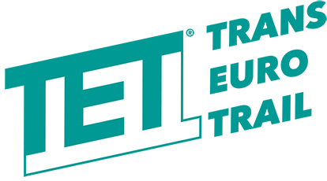

## TET- Trans Euro Trail (Android / iOS apps)

A 51,000km GPX route from the edge of Africa to the Arctic Circle.
Created by our community.
Provided for free.

**EUROPE'S DIRT ROAD ADVENTURE**

This repository is maintained by a private TET community developer. The Trans Euro Trail Community Interest Company is in not responsible for the content found on this repository.

## Help Translate:

Please Submit for the Android App Translation!

https://github.com/johnkeel-thork/TET/tree/master/Android%20App

Following the Android schemas:

**Each language should be put inside a folder named like "values-TWO_LETTER_COUNTRY_CODE"**

- Example for Portuguese translation folder: "values-pt"
- Example for Spanish translation folder: "values-es"

## TET Links
* TET Website URL:
https://www.transeurotrail.org/

* Android App URL:
https://play.google.com/store/apps/details?id=com.obsidianpc.tet

    
* Privacy Policy:
https://github.com/johnkeel-thork/TET/blob/master/Privacy.md

## Donate
* [Buy Me a Coffee](https://www.buymeacoffee.com/johnkeelthork) : Contribute or thank me by paying me a coffee!

## Acknowledgements
* [THORK RACING](https://www.thorkracing.com/en/) : For the server (API Hosting)
* [CARPE ITER](https://github.com/carpeiter) : For being my boss and at the same time sponsors my free-time projects
* [KayDubbya](https://github.com/KayDubbya) : For being my Sponsor
* [nezgrath](https://github.com/nezgrath) : For being my Sponsor
* [raschaa](https://github.com/raschaa) : For being my Sponsor
* [Freepik](https://www.freepik.com) : for the Country Flags - from www.flaticon.com
* [Drive Mode Dashboard](https://www.drivemodedashboard.com) : For the GPX Parser, Waypoint Icons, Track Filter, Waypoint Cleanup
* [LongRideZone](https://www.facebook.com/longridezone) : For the beta testing and translations
* [ncwp Nico](https://github.com/ncwp) : For translations
* [antonin-a Antonin](https://github.com/antonin-a) : For translations
* [samikokkonen](https://github.com/samikokkonen) : For translations
